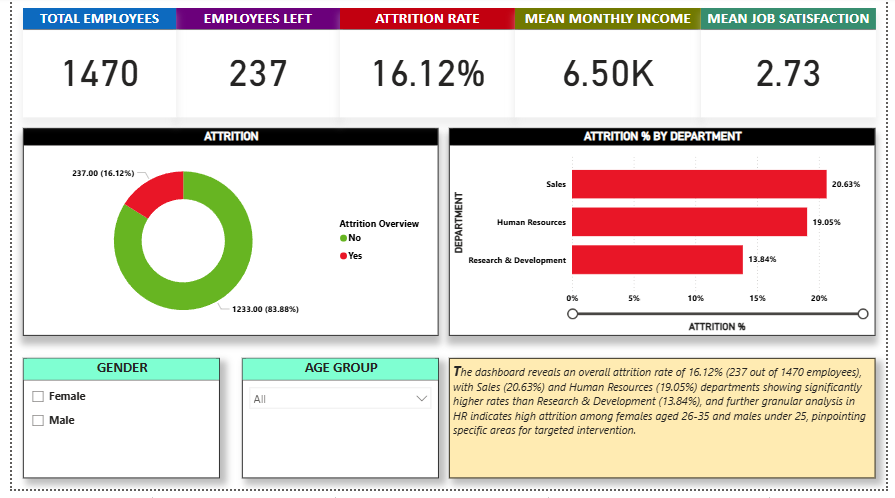
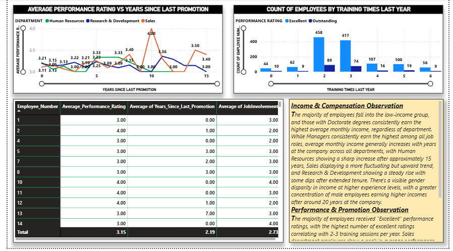

```markdown
# IBM HR Analytics Attrition Dashboard

This repository contains a Power BI project focused on analyzing employee attrition using the IBM HR Analytics Attrition Dataset. The dashboard provides key insights into factors influencing attrition, employee demographics, job satisfaction, performance, and income, empowering HR departments to make data-driven decisions.

## 📊 Dashboard Overview

The Power BI dashboard offers an interactive and comprehensive view of various HR metrics. It is designed to help understand:

* **Overall Attrition Rate:** A clear picture of the percentage of employees leaving the company.

* **Attrition by Key Demographics:** Analysis of attrition trends across departments, job roles, education fields, marital status, gender, and age groups.

* **Employee Satisfaction:** Insights into job satisfaction, work-life balance, environment satisfaction, and relationship satisfaction.

* **Performance & Compensation:** Examination of performance ratings, training impact, and monthly income distribution by education, job role, and years at the company.

## 🚀 Key Features

* **Interactive Visualizations:** Dynamic charts and graphs allow for in-depth exploration of the data.

* **Key Performance Indicators (KPIs):** Prominent display of total employees, employees left, attrition rate, mean monthly income, and mean job satisfaction.

* **Demographic Segmentation:** Filters and breakdowns by Gender, Age Group, Department, Job Role, Education Field, and Marital Status for granular analysis.

* **Actionable Insights:** Text summaries accompanying each dashboard page highlight critical observations and potential areas for HR intervention.

## 📈 Dashboard Pages

The dashboard is structured into multiple pages, each focusing on different aspects of the HR data:

### 1. Attrition Overview

This page provides a high-level summary of attrition, including the overall attrition rate and a breakdown by department.



* **Key Metrics:** Total Employees, Employees Left, Attrition Rate, Mean Monthly Income, Mean Job Satisfaction.

* **Visuals:** Donut chart for overall attrition, bar chart for attrition by department.

* **Insights:** Highlights departments with higher attrition rates and provides an initial understanding of the overall employee turnover.

### 2. Attrition Deep Dive (as2.png)

This page delves deeper into attrition by examining it across various job roles, education fields, and marital statuses.


* **Visuals:** Bar charts for attrition by job role, education field, and marital status.

* **Insights:** Identifies specific roles, education backgrounds, and marital statuses that are more prone to attrition.

### 3. Income & Compensation Analysis

This section focuses on employee income and compensation, breaking it down by income group, educational qualification, years at the company, and job role.


* **Visuals:** Bar charts for employee count by income group and average monthly income by educational qualification/job role, line chart for average monthly income by years at company and department, scatter plot for monthly income vs. years at company.

* **Insights:** Reveals income distribution patterns and how income changes over an employee's tenure and across different roles/departments.

### 4. Performance & Promotion Insights

This page explores employee performance ratings and their relationship with promotions and training.



* **Visuals:** Line chart for average performance rating vs. years since last promotion, bar chart for count of employees by training times last year, detailed table.

* **Insights:** Helps understand the correlation between performance, promotions, and training, identifying potential areas for career development and recognition.

### 5. Job Satisfaction & Work-Life Balance

This page provides insights into various aspects of employee satisfaction, including job satisfaction, work-life balance, environment satisfaction, and relationship satisfaction.


* **Visuals:** Bar charts for work-life balance by overtime and job satisfaction by department, average satisfaction score cards.

* **Insights:** Uncovers how different factors contribute to overall employee well-being and satisfaction levels across various groups.

## 📂 Project Structure
.
├── HR-Analytics.pbix                 \# The main Power BI report file
├── HR-Employee-Attrition.csv         \# The dataset containing IBM HR attrition data
├── README.md                         \# This README file
└── Previews/                         \# Folder containing dashboard screenshots
├── ExecutiveSUmmary.png
├── as2.png
├── as3.png
├── as4.png
└── as5.png


## ⚙️ Technologies Used

* **Microsoft Power BI Desktop:** For data modeling, transformation, and visualization.

## 📊 Data Source

The data used for this analysis is the **IBM HR Analytics Attrition Dataset**, publicly available on Kaggle.

* **Dataset Link:** <https://www.kaggle.com/datasets/pavansubhasht/ibm-hr-analytics-attrition-dataset>

## 🚀 How to Use This Project

1.  **Clone the Repository:**

    ```bash
    git clone [https://github.com/teesta57/HR-Attrition-Analytics.git](https://github.com/teesta57/HR-Attrition-Analytics.git)
    ```

2.  **Open in Power BI Desktop:** Open the `HR-Analytics.pbix` file using Power BI Desktop.

3.  **Explore the Dashboard:** Interact with the various filters and visuals to explore the data and derive your own insights.

## 🤝 Contributing

Feel free to fork this repository, explore the data, and enhance the dashboard. Suggestions and improvements are always welcome!

## 📄 License

This project is open-source and available under the [MIT License](https://opensource.org/licenses/MIT).

---
**Note:** This dashboard is for illustrative and portfolio purposes only. The insights are based on the provided dataset and may not reflect real-world scenarios without further validation and context.
````