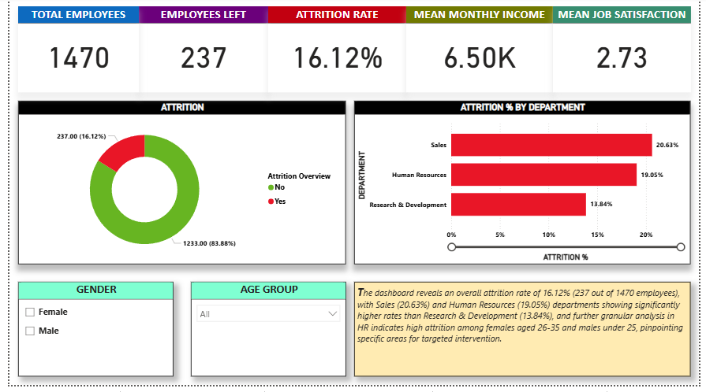
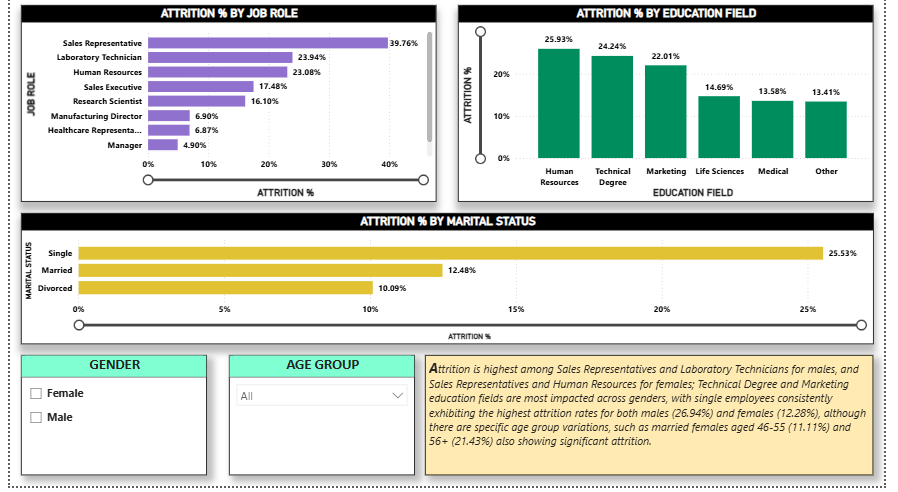
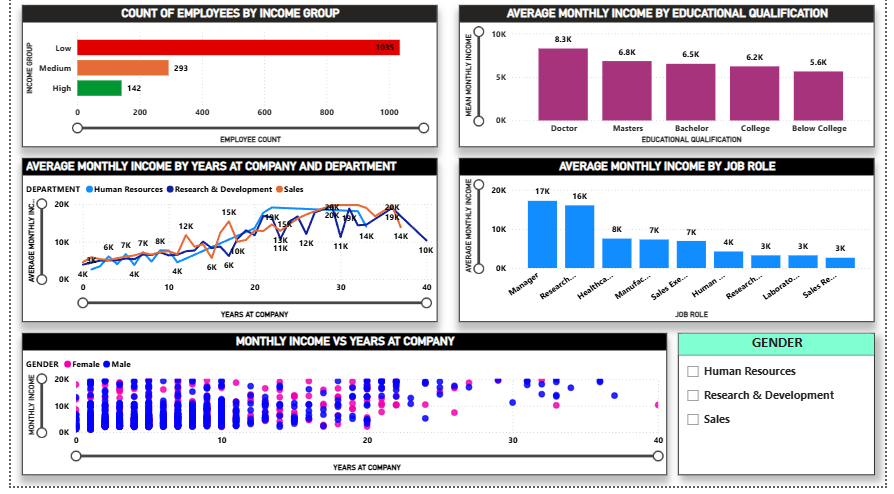
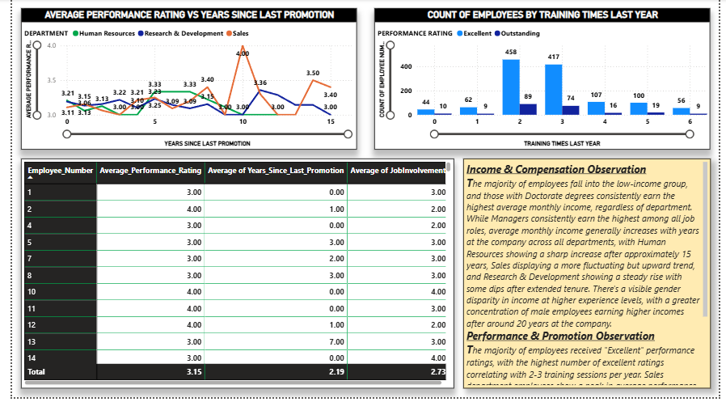
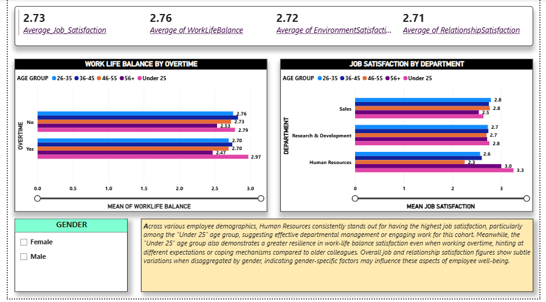

# IBM HR Analytics Attrition Dashboard

This project presents a Power BI dashboard analyzing employee attrition using the IBM HR Analytics Attrition Dataset. The dashboard offers valuable insights into factors affecting attrition, employee demographics, job satisfaction, performance, and compensation—empowering HR teams to make data-driven decisions.

---

## 📊 Dashboard Overview

The dashboard provides a comprehensive and interactive analysis of key HR metrics. It helps uncover:

* **Overall Attrition Rate** — The percentage of employees who have left the company.
* **Attrition by Demographics** — Breakdown by department, job role, education field, marital status, gender, and age.
* **Employee Satisfaction** — Evaluation of job satisfaction, work-life balance, environment, and relationships.
* **Performance & Compensation** — Insights into performance ratings, training impact, and salary distribution by role and tenure.

---

## 🚀 Key Features

* **Interactive Visuals** — Clickable charts and filters to explore the data deeply.
* **Key Performance Indicators (KPIs)** — At-a-glance metrics such as total employees, attrition rate, average income, and satisfaction.
* **Demographic Segmentation** — Filters by gender, department, job role, education, marital status, and age group.
* **Actionable Insights** — Each page includes summaries highlighting trends and red flags for HR strategy.

---

## 📈 Dashboard Pages

### 1. Attrition Overview

* **What it shows:** Total attrition, attrition by department.
* **Key metrics:** Attrition rate, mean income, mean job satisfaction.
* **Visuals:** Donut chart (overall attrition), bar chart (by department).
* **Insights:** Identifies departments with high turnover.



---

### 2. Attrition Deep Dive

* **What it shows:** Attrition segmented by job role, education field, and marital status.
* **Visuals:** Bar charts for each category.
* **Insights:** Flags high-risk roles and demographic patterns.



---

### 3. Income & Compensation Analysis

* **What it shows:** Salary breakdown by income group, education, years at company, and role.
* **Visuals:** Bar, line, and scatter charts.
* **Insights:** Reveals pay progression patterns and role-based disparities.



---

### 4. Performance & Promotion Insights

* **What it shows:** Relationships between performance ratings, promotions, and training.
* **Visuals:** Line chart (performance vs. years since promotion), bar charts, tables.
* **Insights:** Pinpoints where training or promotion policies may be affecting morale.



---

### 5. Job Satisfaction & Work-Life Balance

* **What it shows:** Analysis of satisfaction across different areas and groups.
* **Visuals:** Bar charts and scorecards.
* **Insights:** Connects overtime and department with employee satisfaction trends.



---

## 📂 File Structure

```
.
├── HR-Analytics.pbix                (Power BI report file)
├── HR-Employee-Attrition.csv        (Raw dataset)
├── README.md                        (Project documentation)
└── Previews/                        (Dashboard screenshot images)
    ├── ExecutiveSummary.png
    ├── AttritionDeepDive.png
    ├── IncomeAndCompensation.png
    ├── PerformanceAndPromotion.png
    └── SatisfactionAndWorklife.png
```

---

## ⚙️ Technologies Used

* Microsoft Power BI Desktop

---

## 📊 Data Source

* **Dataset Name:** IBM HR Analytics Attrition Dataset
* **Source:** Kaggle
* **Link:** [https://www.kaggle.com/datasets/pavansubhasht/ibm-hr-analytics-attrition-dataset](https://www.kaggle.com/datasets/pavansubhasht/ibm-hr-analytics-attrition-dataset)

---

## 🚀 How to Use This Project

1. Clone or download the repository:

   ```bash
   git clone https://github.com/teesta57/HR-Attrition-Analytics.git
   ```
2. Open the `HR-Analytics.pbix` file in Power BI Desktop.
3. Explore the dashboard and apply filters to interact with the data.

---

## 🤝 Contributing

You're welcome to fork the project, explore the dataset, enhance visualizations, or suggest improvements.

---
